# Serverless

## with AWS Lambda

<br>

<small>
by Peter Cosemans<br>
Copyright (c) 2018 Euricom nv.
</small>

<!-- markdownlint-disable -->
<br>
<style type="text/css">
.reveal section img {
    background:none;
    border:none;
    box-shadow:none;
}
.reveal h1 {
    font-size: 3.0em;
}
.reveal h2 {
    font-size: 2.00em;
}
.reveal h3 {
    font-size: 1.00em;
}
.reveal p {
    font-size: 70%;
}
.reveal blockquote {
    font-size: 100%;
}
.reveal pre code {
    display: block;
    padding: 5px;
    overflow: auto;
    max-height: 800px;
    word-wrap: normal;
    font-size: 100%;
}
</style>

---

# What is serverless

> There are still servers :)

<!-- prettier-ignore -->
***

## What is serverless

> What ‘serverless’ really means is that, as a developer you don’t
> have to think about those servers. You just focus on code.

- Focus on code, not servers
- Function as a unit of application logic
- Minimize maintenance and scalability issues
- Pay for use (granular billing)

<!-- prettier-ignore -->
***

### Evolution of services

<br>

<!-- prettier-ignore -->
***

### Evolution of services

<br>

<!-- prettier-ignore -->
***

## Iaas - Saas - Paas - Faas

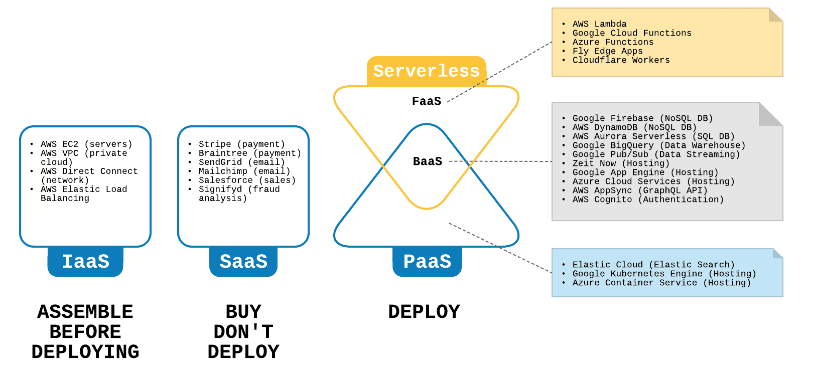<br>

<!-- prettier-ignore -->
***

## From monolith to functions

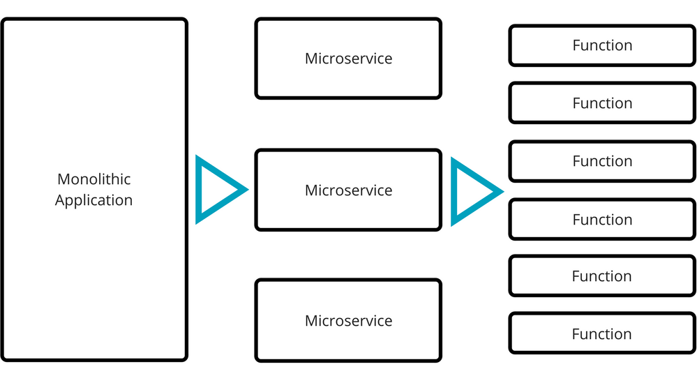<br>

<!-- prettier-ignore -->
***

### Serverless Platforms

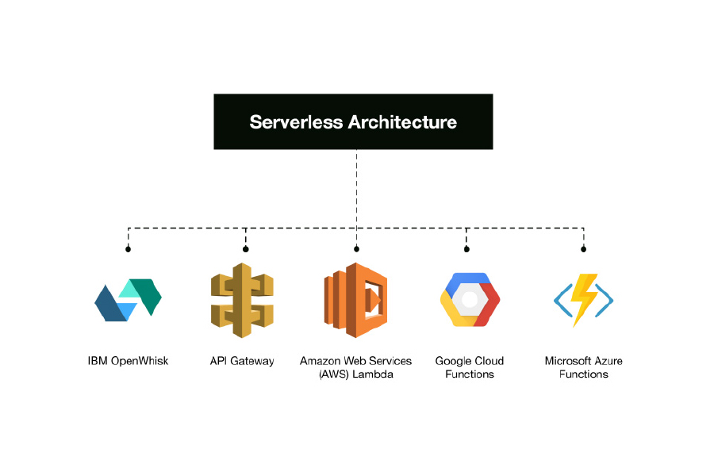<br>

<!-- prettier-ignore -->
***

### Many others...

- Firebase [Cloud Functions](https://firebase.google.com/docs/functions)
- [Netlify Functions](https://www.netlify.com/docs/functions/)
- Auth0 [Webtasks](https://webtask.io/)
- Kubernetes [Kubeless](https://kubeless.io/)
- [Fly.io](https://fly.io/)
- Cloudflare [Workers](https://www.cloudflare.com/products/cloudflare-workers/)
- And...

---

## Serverless Computing

### AWS Lambda

> Run code without provisioning or managing servers/containers.

> Pay Only for the compute time you consume.


<!-- prettier-ignore -->
***

### Anatomy of a lambda function

A simple handler

```js
module.exports.myHandler = (event, context, callback) => {
  const response = {
    foo: 'bar',
  };
  callback(null, response);
};
```

This is a generic handler for all type of triggers: http, cron, SQS, S3, ...

<!-- prettier-ignore -->
***

## Triggers

| Data Store | EndPoints          | Messaging        |
| :--------- | :----------------- | :--------------- |
| S3         | API Gateway        | Amazon SES       |
| DynamoDB   | AWS IoT            | Amazon SNS / SQS |
| Cognito    | AWS Step Functions | Cron Events      |
|            | Amazone Alexa      |                  |

> And more...

<!-- prettier-ignore -->
***

## AWS Lambda Use Cases

- Web Applications
- Data Processing (image/video, batch)
- Sclable Backends (mobile, IoT devices)
- Amazone Alexa
- Chatbots

[Serverless Reference Architectures with AWS Lambda](https://www.allthingsdistributed.com/2016/06/aws-lambda-serverless-reference-architectures.html)

<!-- prettier-ignore -->
***

### Use Case: Web Application

<br>

<!-- prettier-ignore -->
***

### Use Case: Image resize

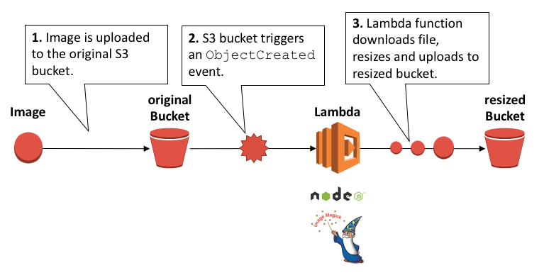<br>

---

## Benefits of AWS Lambda

<!-- prettier-ignore -->
***

## No Servers to manage

AWS lambda handles:

- Operations and management (less DevOps)
- Auto Provisioning
- Availability & fault tolerance

<!-- prettier-ignore -->
***

## Continue Scaling

- Automatically scales your application (nothing -> infinite)
- Your code runs in parallel

<!-- prettier-ignore -->
***

## Billing per invocation

Pay as you go

- CPU and Network scaled based on RAM <br> (128MB to 1500MB)
- $0.20 per 1 million requests
- $0.00001667 for GB-sec
- Free: 400.000 GB-sec (or 1million request) per month

<!-- prettier-ignore -->
***

### Cost of serverless

<br>

<!-- prettier-ignore -->
***

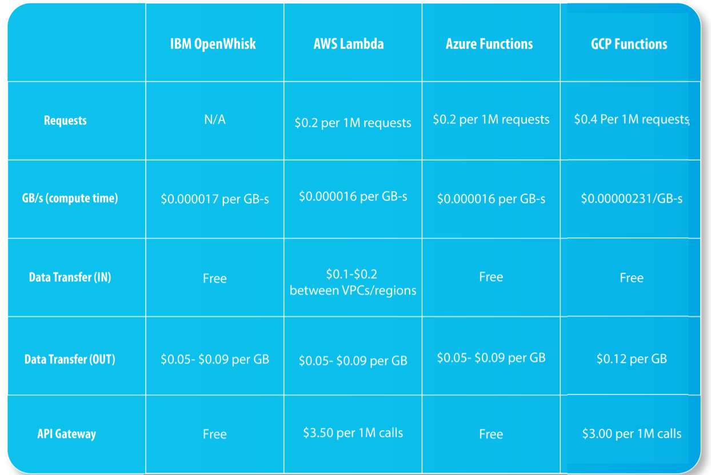<br>

---

# Show me the code

> Lambda - Your gateway to serverless

<!-- prettier-ignore -->
***

## A Simple Lambda Function

Step1: Open [Lambda Services](https://eu-central-1.console.aws.amazon.com/lambda/home)

Step2: Select your region: EU (Frankfurt)

Step3: Create a function

    Author from scratch
    - Name: 'myTestFunction'
    - Runtime: Node.js 8.10
    - Role: 'create a new role'
    - Role name: myTestRole
    - Policy templates: empty

Step4: Run the service


<!-- prettier-ignore -->
***

# Serverless Framework

> The frameworks that makes serverless easy

<!-- prettier-ignore -->
***

### Serverless Framework

- Helps you develop and deploy your AWS Lambda functions
- Supports Node.js, Python, C#, and more
- Handles many platforms

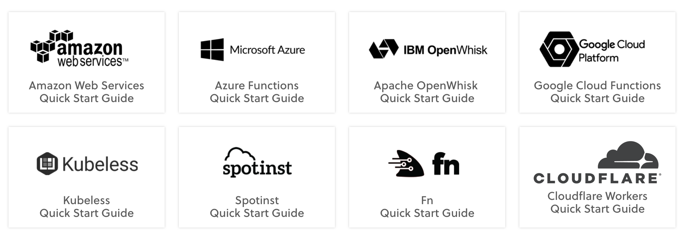

<!-- prettier-ignore -->
***

## Quick Start

Install AWS cli

https://docs.aws.amazon.com/cli/latest/userguide/cli-install-macos.html

Install Serverles Framework

```bash
# Installing the serverless cli
npm install -g serverless
```

Configure

```bash
# Configure AWS security
# Credentials are stored in INI format in ~/.aws/credentials
aws configure
```

Create

```bash
# Create you first service
mkdir myService && cd myService
sls create --template aws-nodejs --name myService
sls create --template aws-csharp --name myService
```

<!-- prettier-ignore -->
***

### Quick Start

Config: serverless.yml

```yaml
# serverless.yml
service: my-service
provider:
  name: aws
  runtime: nodejs8.10
  timeout: 10 # timeout for all function
  environment:
    MONGODB_URI: ${env:MONGODB_URI}

functions:
  hello:
    handler: handler.hello
    memorySize: 128
    timeout: 200
    events:
      - http:
        path: hello
        method: get
     - schedule:
        rate: rate(5 minutes)
        enabled: true
  function2:
    ...
```

Simplifies cloud configuration.


<!-- prettier-ignore -->
***

### Quick Start

Handler:

```js
// handler.js
module.exports.hello = (event, context, callback) => {
  const response = {
    foo: 'bar',
  };
  callback(null, response);
};
```

Deploy:

```bash
# Deploy the service
serverless deploy --verbose
serverless deploy --stage dev --aws-profile devProfile

# Deploy the function
serverless deploy function -f hello
```

<!-- prettier-ignore -->
***

## Other commands

```bash
# Invokes a Function and returns logs.
serverless invoke -f hello -l

# Fetch the function logs
serverless logs -f hello -t

# Remove all functions, evens and resources
serverless remove
```

---

# Advanced Serverless Framework
> More the just a function wrapper

<!-- prettier-ignore -->
***

## Security

AWS - IAMRoles

```
provider:
  name: aws
  runtime: nodejs6.10
  iamRoleStatements:
    - Effect: Allow
      Action:
        - s3:*
      Resource: "arn:aws:s3:::${self:custom.bucket}/*"
    - Effect: Allow
      Action: s3:ListBucket
      Resource: "arn:aws:s3:::${self:custom.bucket}"
```

<!-- prettier-ignore -->
***

## Resources

AWS - Resources

```
resources:
  Resources:
    S3BucketBackup:
      Type: AWS::S3::Bucket
      Properties:
        BucketName: "${self:custom.bucket}"
    usersTable:
      Type: AWS::DynamoDB::Table
      Properties:
        TableName: usersTable
        AttributeDefinitions:
          - AttributeName: email
            AttributeType: S
        KeySchema:
          - AttributeName: email
            KeyType: HASH
        ProvisionedThroughput:
          ReadCapacityUnits: 1
          WriteCapacityUnits: 1
```

See also [Serverless Resources](https://serverless.com/framework/docs/providers/aws/guide/resources/)

<!-- prettier-ignore -->
***

## Plugings

> Many 3th aprty plugins available

- serverless-offline
- serverless-webpack
- serverless-plugin-warmup
- serverless-plugin-typescript
- serverless-dotenv-plugin
- serverless-plugin-aws-alerts
- serverless-apig-s3
- serverless-api-cloudfront

```bash
# command line
serverless plugin list
serverless plugin install --name serverless-stage-manager

```

<!-- prettier-ignore -->
***

## Serverless Code Patterns

- Microservice pattern (function per event)
- Service pattern (crud in one)
- Monolithic pattern (all in one)

[See more](https://serverless.com/blog/serverless-architecture-code-patterns/)

---

# AWS Step Functions

> If serverless functions are stateless, how do I manage state?

See also Azure Logic Apps

<!-- prettier-ignore -->
***


## Problems

- I want to sequence functions
- I want to run function in parallel
- I want to selct functions based on data
- I want to retry functions
- I want to try/catch/finally
- I have code that runs for hours

<!-- prettier-ignore -->
***

## AWS Step functions

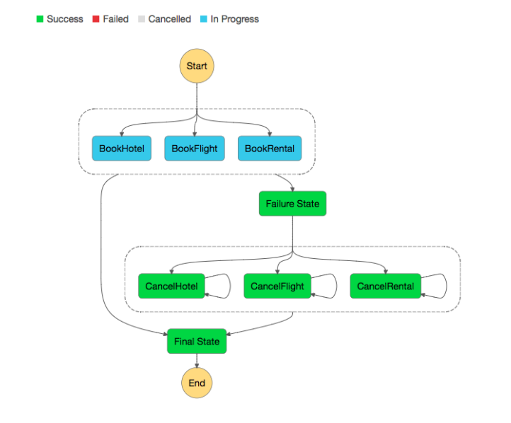

Makes it seay to coordinate the components of distributed application

<!-- prettier-ignore -->
***

### AWS Step functions: Use-case

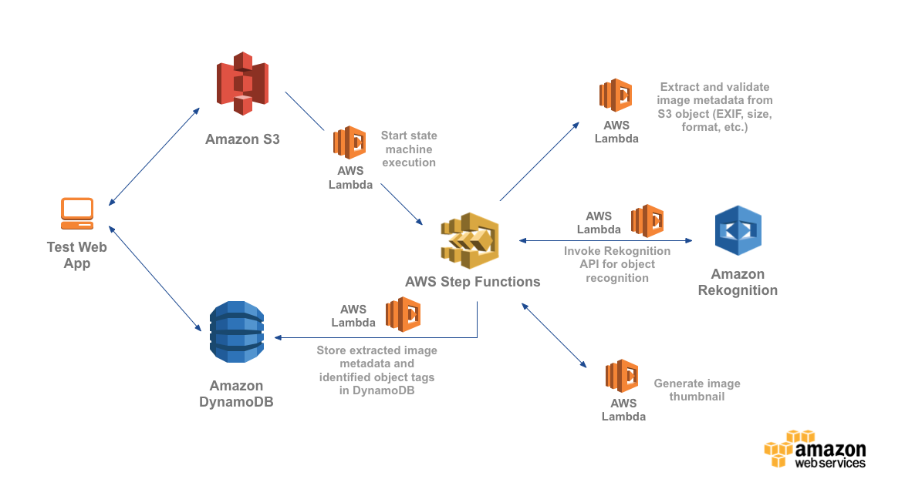

---

# The limitations/drawbacks of serverless

<!-- prettier-ignore -->
***

## AWS Lambda Limits

- Concurrent Executions: 1000
- Memory Allocation: 128MB to 3008MB
- Timeout: 900 sec (15 min)
- Env variables: 4KB
- Invocation payload: 6MB (event size)
- Deployment Package: 50MB zipped
- /tmp directory storage: 512 MB
- File descriptors: 1024

<!-- prettier-ignore -->
***

## Understanding AWS Lambda Costs

> Costs are multiplicative in function memory size and execution time.

$ 0.000016 for GB-sec (start from 100ms \* 128MB)

=> 10242MB, 1000ms = $ 0.000016

| Invocations | Memory | Duration | Cost ($) |
| :---------- | :----- | :------- | -------- |
| 100.000     | 512MB  | 200ms    | 0.1667   |
| 100.000     | 512MB  | 400ms    | 0.3334   |
| 100.000     | 1024M  | 800ms    | 1.3336   |
| 1.000.000   | 1024M  | 800ms    | 13.336   |


<!-- prettier-ignore -->
***

## Understanding AWS Lambda Costs

Processing delays can be expensive

> A 2 sec delay to external HTTPS service can be 11 times more expensive:

The free tier can run out quickly (1M)

> 100,000 requests per hour (27/sec), 1536MB, 2000ms: 1 hour free

<!-- prettier-ignore -->
***

## Some examples

- EC2: m5.large - 8GB Mem, 2 vCPUs x 2 = US$138
- Lambda: 100 req / min, avg 300ms, 512 mb = US$11
- Lambda: 1000 req / min, avg 300ms, 1024 mb = US$230

Check out [servers.lol](https://servers.lol) for more.

<!-- prettier-ignore -->
***

## Cold starts

> A cold start only happens if there is no idle container available waiting to run the code. This is all invisible to the user and AWS has full control over when to kill containers.

<!-- prettier-ignore -->
***

## Cold starts

> How bad is it?

- Startup: 500ms to 2000ms
- Sleep after 5 - 60min of inactivity
- Depending of language, mem, code size and VPC
  <br><br>

> When should you care?

- If you have a customer facing application
- If your request volume is low or sparse
- Once you deploy a new version (all containers are destroyed)

<!-- prettier-ignore -->
***

## Cold starts

>  How to improve?

- Increate memory (and pay more)
- Wait for AWS to improve it
- Do some warm-up ([do it smart though!](https://medium.com/thundra/dealing-with-cold-starts-in-aws-lambda-a5e3aa8f532))

<!-- prettier-ignore -->
***

## Connection Pooling Limitation

> The Issue

1. Isolated state per function
2. A DB connection per function
3. Connections limit per DB.

> Solution

- Declare the db object outside the handler
- Avoid database with connection pooling
- Use AWS DynamoDB, Google Firebase or Mongo Stitch

<!-- prettier-ignore -->
***

## No Support For WebSocket

> The Issue

1. A WebSocket = long-lived connection
2. AWS Lambda = short live time

> Solution

- [AWS IoT](AWS IoT) (support MQTT)
- https://fanout.io/

<!-- prettier-ignore -->
***

## Other Drawbacks

- Vendor lock-in
- SLA — Service Level Agreements (99.95%)
- Maintaining many small services may be troubling

<!-- prettier-ignore -->
***

---

# Performance testing
> Can we get the performance

<!-- prettier-ignore -->
***

### Lambda

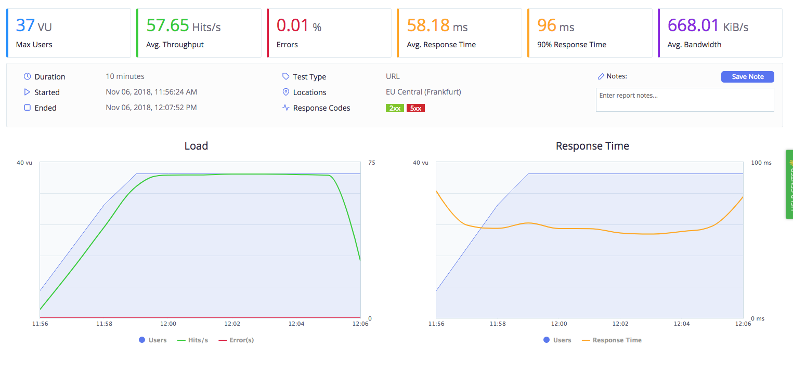
<br>
Test performed by https://www.blazemeter.com/

<!-- prettier-ignore -->
***

### Now (fastify x 2 instances)

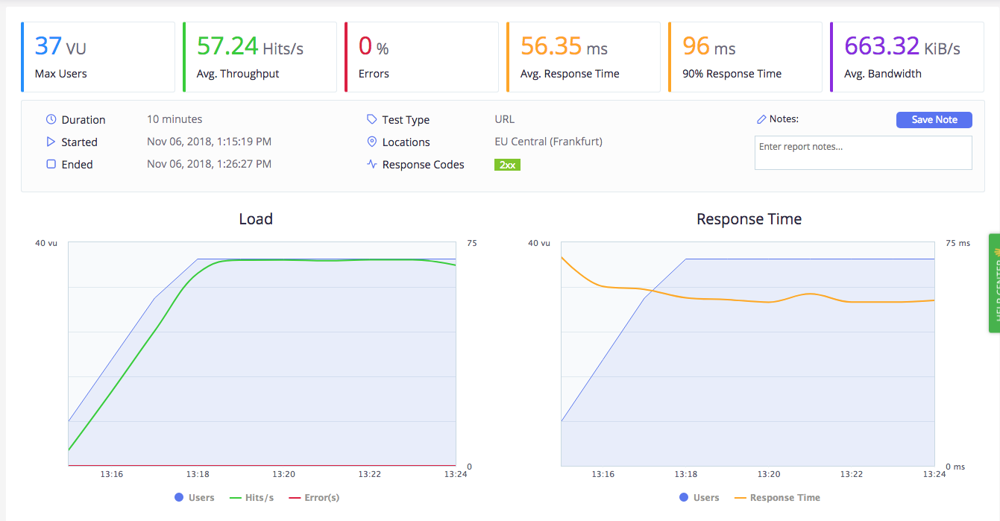

<!-- prettier-ignore -->
***

### Lambda - Response time

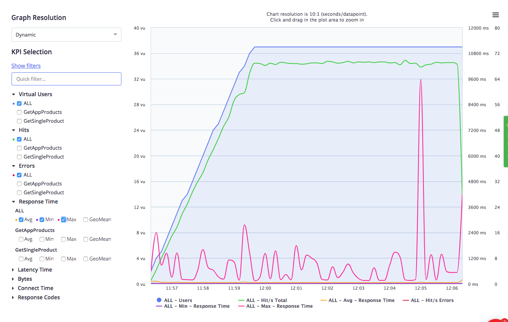

Lots of high peeks

<!-- prettier-ignore -->
***

### Now - Response time

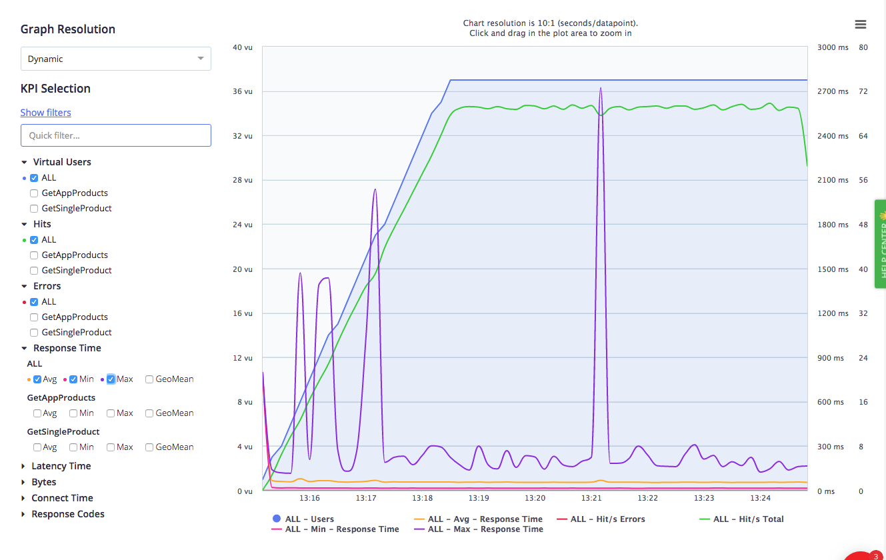

Higher maximum but more stable

<!-- prettier-ignore -->
***

### Lambda/Now - MongoDB

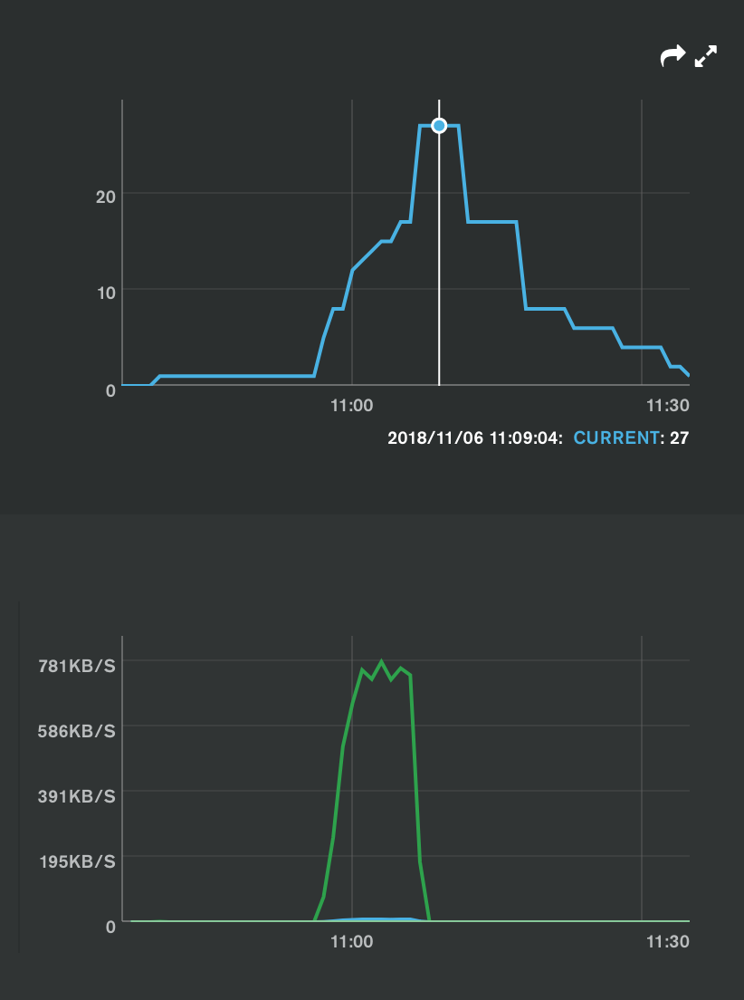
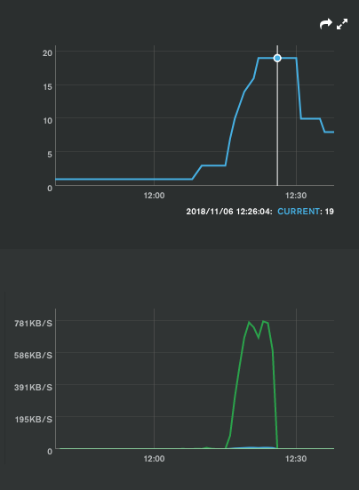

Lambda will use more connections


---

# Conclusion

> Serverless is not a silver bullet. The gains you can obtain from it depend on your knowledge of it. The good part is that the barrier to entry is so low that you should be proficient in no time.

---

# Thank You 👋

---

## Resources

- [Optimizing AWS Lambda performance with MongoDB and Node.js](https://www.mongodb.com/blog/post/optimizing-aws-lambda-performance-with-mongodb-atlas-and-nodejs)
- [Dealing with cold starts in AWS Lambda](https://medium.com/thundra/dealing-with-cold-starts-in-aws-lambda-a5e3aa8f532)
- [Understanding and Controlling AWS Lambda Costs](https://serverless.com/blog/understanding-and-controlling-aws-lambda-costs/)
- [THE SERVERLESS SERIES — What Is Serverless](https://hackernoon.com/the-serverless-series-what-is-serverless-d651fbacf3f4)
- [GitHub - Serverless service with basic MongoDB](https://github.com/adnanrahic/building-a-serverless-rest-api-with-nodejs)
- [GitHub - Serverless service with basic MongoDB Stitch](https://github.com/adnanrahic/building-a-serverless-rest-api-with-nodejs-and-mongodb-stitch)
- [The hidden costs of serverless](https://medium.com/@amiram_26122/the-hidden-costs-of-serverless-6ced7844780b)

---

# Will Serverless Computing change the web?
