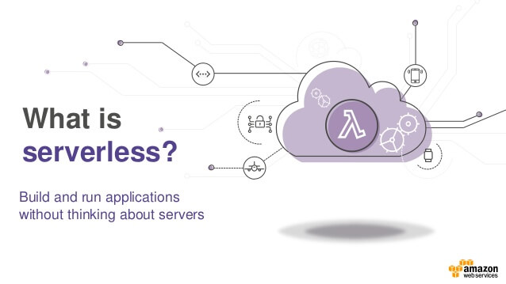
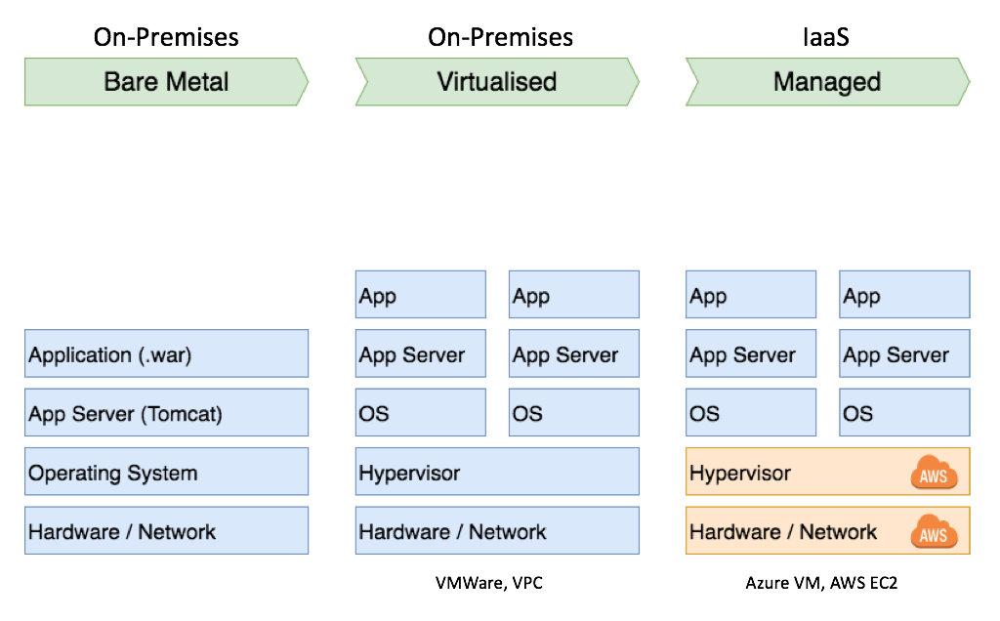
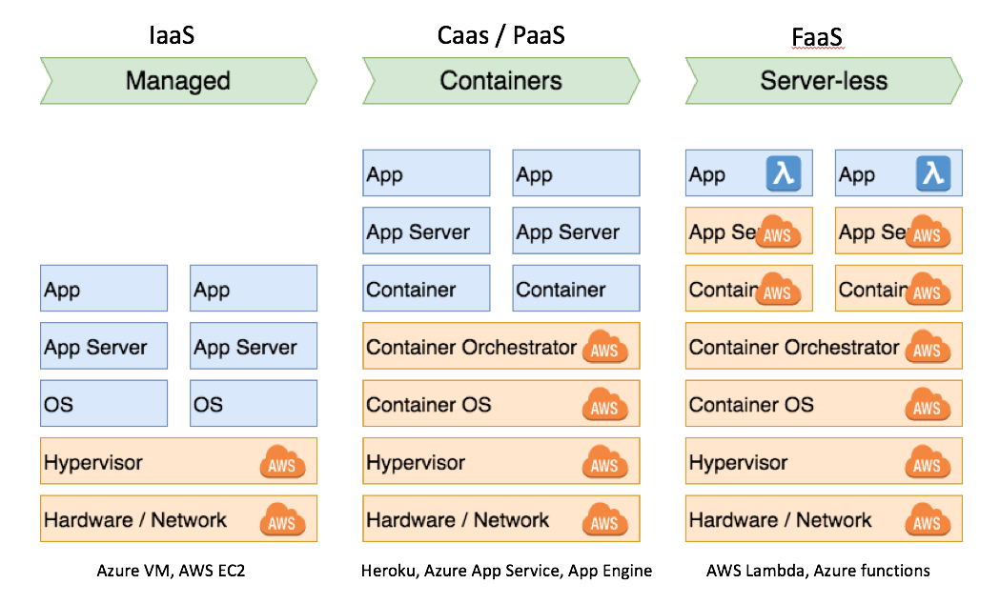
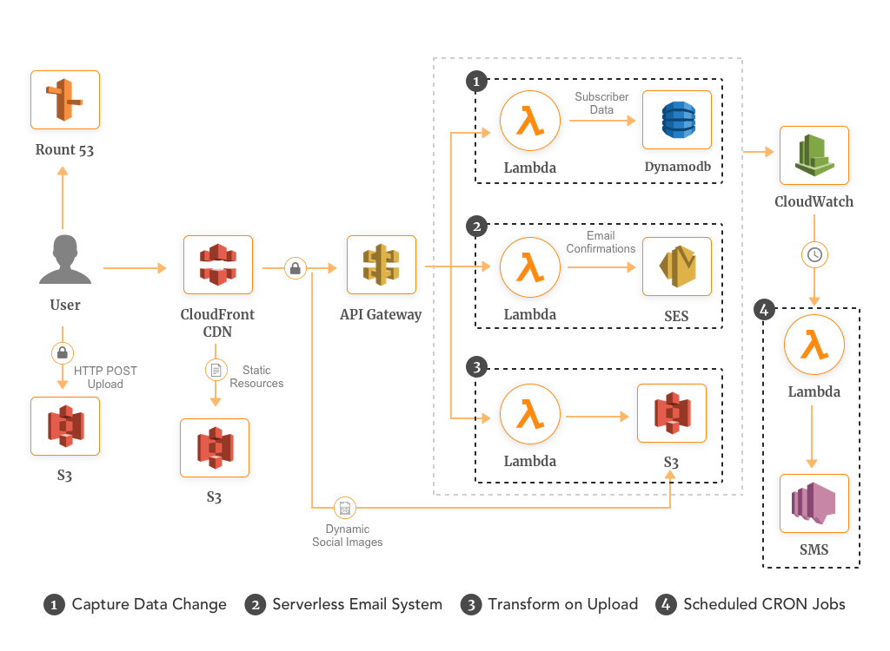
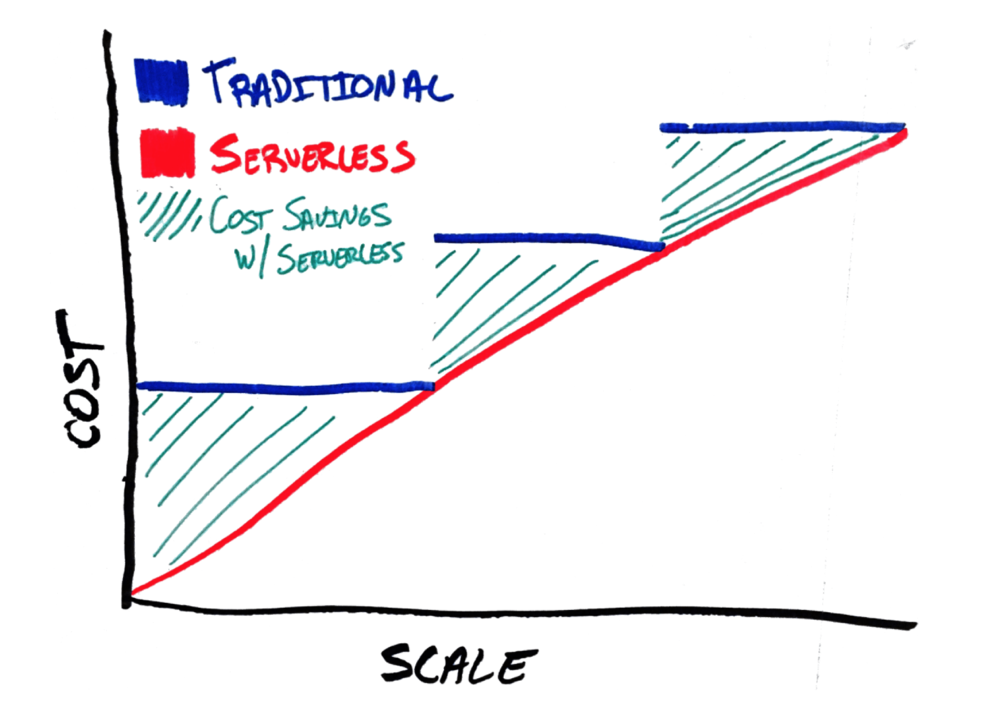

# Serverless

## with AWS Lambda

<br>

<small>
by Peter Cosemans<br>
Copyright (c) 2018 Euricom nv.
</small>

<!-- markdownlint-disable -->
<br>
<style type="text/css">
.reveal section img {
    background:none;
    border:none;
    box-shadow:none;
}
.reveal h1 {
    font-size: 3.0em;
}
.reveal h2 {
    font-size: 2.00em;
}
.reveal h3 {
    font-size: 1.00em;
}
.reveal p {
    font-size: 70%;
}
.reveal blockquote {
    font-size: 100%;
}
.reveal pre code {
    display: block;
    padding: 5px;
    overflow: auto;
    max-height: 800px;
    word-wrap: normal;
    font-size: 100%;
}
</style>

---

# What is serverless

> There are still servers :)

<!-- prettier-ignore -->
***

## What is serverless

> What ‘serverless’ really means is that, as a developer you don’t
> have to think about those servers. You just focus on code.

- Focus on code, not servers
- Function as a unit of application logic
- Minimize maintenance and scalability issues
- Pay for use (granular billing)

<!-- prettier-ignore -->
***

### Evolution of services

<br>

<!-- prettier-ignore -->
***

### Evolution of services

<br>

<!-- prettier-ignore -->
***

## Function as a Service

- Triggers (Many)
- State (Limited or no state)
- Execution Duration (Limited)
- Scalability and Cost (managed scalability, pay per use)

<!-- prettier-ignore -->
***

## Use Cases

- API Backends
- Background processing
- ...

<!-- prettier-ignore -->
***

## Drawbacks of serverless

- Vendor lock-in
- SLA — Service Level Agreements (99.95%)
- Maintaining many small services may be troubling
- Potentially slightly slower service start (500ms - 2sec)

<!-- prettier-ignore -->
***

### Triggers

- Data Stores
  - S3
  - DynamoDB
  - Cognito
- EndPoints
  - API Gateway
  - AWS IoT & Amazone Alexa
  - AWS Step Functions
- Event/Message Services
  - Amazon SES & SNS
  - Cron Events
- And more...

<!-- prettier-ignore -->
***

### Triggers: Web Application

<br>

<!-- prettier-ignore -->
***

## Cost

<br>

<!-- prettier-ignore -->
***

## Cost

```
- EC2: m5.large - 8GB Mem, 2 vCPUs x 2      = US$138
- Lambda: 100 req / min, avg 300ms, 512 mb  = US$11
- Lambda: 1000 req / min, avg 300ms, 512 mb = US$116
- Lambda: 1000 req / min, avg 300ms, 1024 mb = US$230
```

---

## Resources

---

# Will Serverless Computing change the world?
